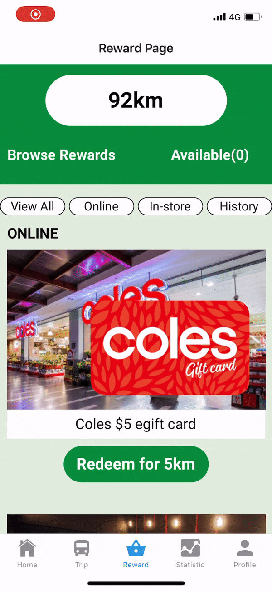
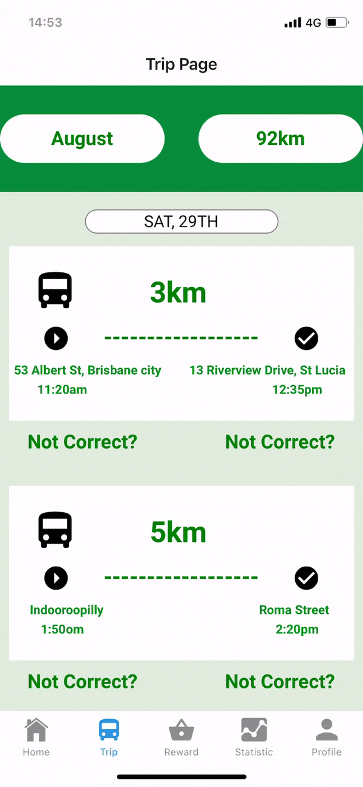
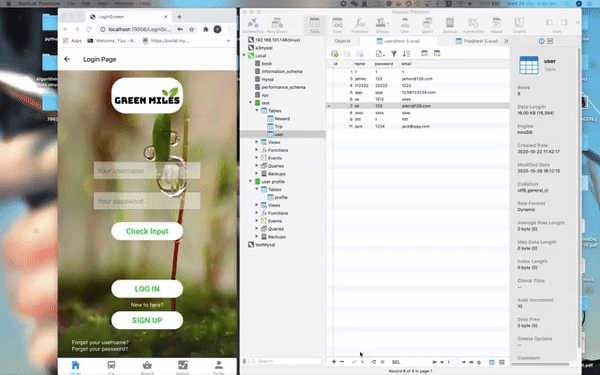

# React native app -  GreenMiles
<p align="center">
  
</p>

We are team named 'We are AWESOME!!!'  
Team members: Thomas Chen, Bosheng Zhang, Junyi Xie, Eden Ke, Jonathan Lau, Lester Phua

# [Test our application](https://expo.io/@danielzhang/projects/GreenMilesProject) :point_left::point_left::point_left:
**We appreciate any feedback!!** :pray::pray::pray:

### Problem Statement:
Inner-city congestion remains a growing problem in today’s technological society and we need a cost-effective, ethical, and social solution.
### What is Green Miles? 
**Green Miles** is an application that allows its users to track their carbon footprint. As the world progresses into a technologically advanced era, there is an increased awareness in global warming and greenhouse gas emissions. 
 
Therefore, the aim of Green Miles is to provide an incentive to use public transport and allow our users to collaborate socially with other commuters. It will also inform the users of the impact they are having on the environment and allows them to redeem gift cards with points they earned by using public transport. 

### Setting up the development environment
Expo is a set of tools built around React Native and, while it has many features, the most relevant feature for us right now is that it can get you writing a React Native app within minutes. You will only need a recent version of Node.js and a phone or emulator. 
```shell
npm install -g expo-cli
```
Once you have fork and clone our repository, run command below to make sure node_module is installed
```shell
npm install
```
Then, You are good to try our application out
```shell
expo start
```

### What is Green miles looks like:
**Leaderboard:**
<p align="center">
  
</p>

**Reward System:**

<p align="center">
  
</p>

**Trip:**

<p align="center">
  
</p>

**Database Connection:**

<p align="center">
  
</p>

### What I have learned: 
1. Design, build and clearly document a significant software solution based on a design brief.
2. Apply previous experience and skills in multimedia design and software development to deliver a complete and polished system that meets your client's requirements within a pre-determined deadline.
3. Investigate and overcome challenges associated with implementing new designs and technologies.
4. Apply sound project management skills (using relevant tools where necessary) to successfully deliver a software development project.
5. Apply investigative, experimental, and prototyping methods in the software design and development process.
6. Communicate effectively with stakeholders to gather requirements and context on briefs, and to manage stakeholder expectations over the course of a project.
7. Develop the necessary skills to work successfully in a multi-disciplinary team, including the application and evaluation of different methods for collaborative team work.
8. Explain and apply appropriate methods of user investigation, involvement and evaluation, using techniques tailored to your specific software development project.
9. Demonstrate sound critical and professional judgment with respect to the ethical issues associated with technology projects or products, and apply ethical thinking to your own work.
